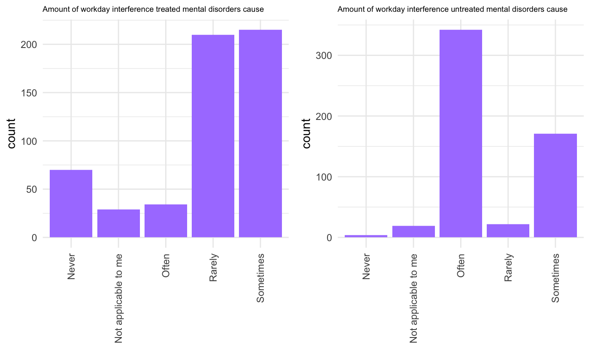
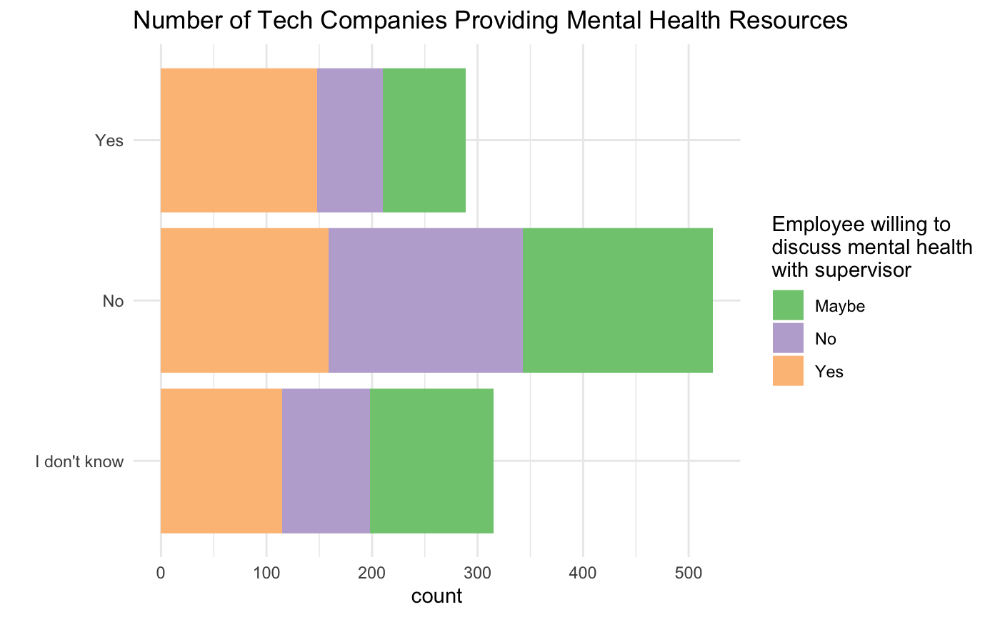
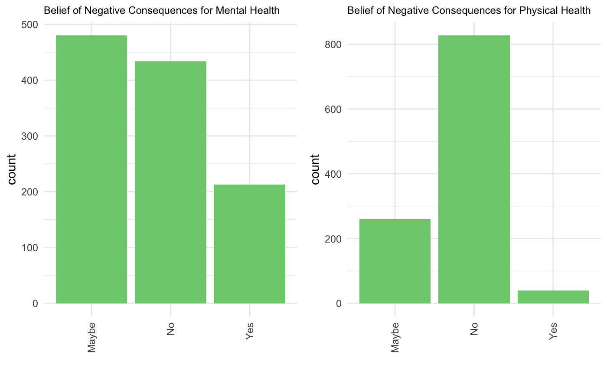
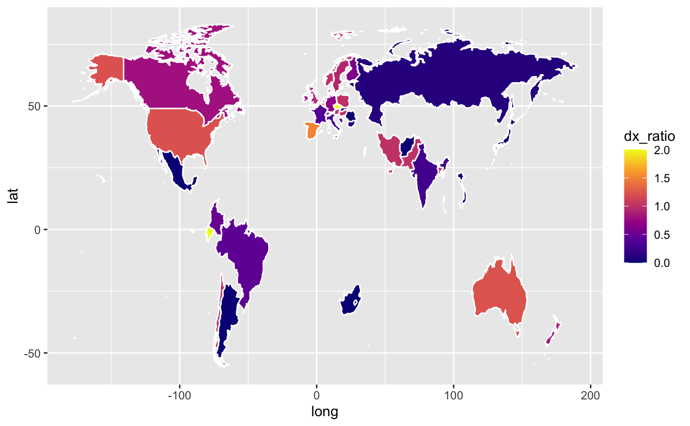
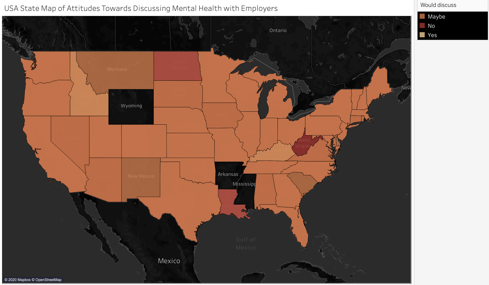

```{r setup, include=FALSE}
knitr::opts_chunk$set(echo = TRUE, message = FALSE)
```

With the previously cleaned csv file (see 01_do_data_cleaning.R), the following exploratory data analysis (EDA) looks to determine general patterns and characteristics of the project data prior to modeling.

**Overarching exploratory questions addressed**:      

1. Of the surveyed tech employees how many are clinically diagnosed with a mental disorder and/or receiving therapy? How often does this interfere with their work?  

2. How many tech employees are comfortable with or have spoken with their supervisors and/or coworkers about mental health? Does employee mental health status or gender impact these trends?  

3. How many companies offer mental health services? Does this vary according to company size? Could this impact employee willingness to discuss mental health?  

4. How many employees believe discussing their mental health with their employer would have negative consequences? How does this compare to the number of employees who believe discussing their physical health with their employer would have negative consequences?  

5. Do the number of average number of diagnosed mental disorders per surveyed employee vary according to country?


----

Importing libraries...
```{r libs}
library(tidyverse)
library(fastDummies)
library(ggplot2)
library(RColorBrewer)
library(gridExtra)
library(countrycode)
library(geojsonio)
source("~/Documents/Data_Science/projects/medium/code/script/functions/funs_do_exploratory_data_analysis.R")
```

Loading data...
```{r data}
clean_df <- read.csv("~/Documents/Data_Science/projects/medium/data/processed_data/mental-health-in-tech-2016-clean.csv", stringsAsFactors = FALSE)
head(clean_df)
str(clean_df)
```

The survey data has 1127 observations (participants) and 85 variables. There are no missing values, and only 3 continuous variables. 

```{r stats}
summary(clean_df$age)
table(clean_df$gender)
```

The average age of the company-employed employees surveyed is 33.32 years, with a range of 17 to 70 years. Of these employees 263 identified as female, 840 identified as male and 24 indicated an alternative gender identify, underscoring the significant gender gap often prevalent in tech-related companaies. 

#### EDA topic #1
---
* Of the surveyed tech employees how many are clinically diagnosed with a mental disorder and/or receiving therapy? How often does this interfere with their work?

```{r mh dx, results=FALSE}
ggplot(clean_df, aes(mh_dx)) +
  geom_bar(aes(fill = as.factor(mh_treatment))) +
    scale_fill_brewer(palette="Accent") +
    theme_minimal() +
    labs(fill = "Receiving therapy \n(Yes = 1)") +
    xlab(" ") +
    ggtitle("Employee Mental Disorder Diagnosis Status")
```


There is a very similar number of participants with and without a mental disorder diagnosis. The vast majority of those with a mental disorder attend therapy, while most of those without a diagnosis do not. 

```{r mh dx2, results=FALSE}
dx_df <- clean_df %>% filter(mh_dx == "Yes")
no_dx_df <- clean_df %>% filter(mh_dx == "No")

p1 <- PlotMIInterference(dx_df, dx_df$mh_interfere_treated)
p1 <- p1 + ggtitle("Amount of workday interference treated mental disorders cause") +
    theme(axis.text.x = element_text(angle = 90, vjust = 0.5, hjust=1)) + 
    theme(plot.title = element_text(size=7))

p2 <- PlotMIInterference(dx_df, dx_df$mh_interfere_not_treated)
p2 <- p2 + ggtitle("Amount of workday interference untreated mental disorders cause")+ 
    theme(axis.text.x = element_text(angle = 90, vjust = 0.5, hjust=1)) + 
    theme(plot.title = element_text(size=7))

grid.arrange(p1, p2, nrow = 1)
```


Those with a mental disorder and also receiving therapy have less interference in their workplace productivity due to mental health concerns compared to those with a mental disorder who aren't receiving therapy. 

#### EDA topic #2
---
* How many tech employees are comfortable with or have spoken with their supervisors and/or coworkers about mental health? Does employee mental health status or gender impact these trends?

```{r t2 plot, results=FALSE}
p3 <- PlotMIComfort(clean_df, clean_df$mh_discussion_coworkers)
p3 <- p3 + ggtitle("Comfortable speaking to coworkers about mental health") + 
    theme(plot.title = element_text(size=9))

p4 <- PlotMIComfort(clean_df, clean_df$mh_discussion_supervisor)
p4 <- p4 + ggtitle("Comfortable speaking to supervisor about mental health") + 
    theme(plot.title = element_text(size=9))

grid.arrange(p3, p4, nrow = 1)
```

More people are willing to talk to their supervisors about their mental health than coworkers. We can also further delineate the above distribution by demographic information with a dpylr dataframe. 

```{r comfort demos}
coworker_demo_table <- DemoTable("mh_discussion_coworkers")
head(coworker_demo_table)

supervisor_demo_table <- DemoTable("mh_discussion_supervisor")
head(supervisor_demo_table)
```

#### EDA topic #3
---
* How many companies offer mental health services? Does this vary according to company size? Could this impact employee willingness to discuss mental health?

```{r mh resources, results=FALSE}
ggplot(clean_df, aes(mh_resources)) +
  geom_bar(aes(fill = as.factor(mh_discussion_supervisor))) +
    scale_fill_brewer(palette="Accent") +
    theme_minimal() +
    labs(fill = "Employee willing to \ndiscuss mental health \nwith supervisor") +
    xlab(" ") +
    ggtitle("Number of Tech Companies Providing Mental Health Resources") +
    coord_flip()
```

We will also create a quick table to see if there is a potential relationship between company-offered mental health services and employees' willingness to talk to their supervisor about their mental health status.

```{r mh table}
table(clean_df$mh_resources, clean_df$mh_discussion_supervisor)
```

51% of employees' whose company offers mental health resources would feel comfortable disclosing their personal mental health status to their supervisors, compared to the 30% of employees without company-offered mental health services.

#### EDA topic #4
---
* How many employees believe discussing their mental health with their employer would have negative consequences? How does this compare to the number of employees who believe discussing their physical health with their employer would have negative consequences?

```{r mh negative, results=FALSE}
p7 <- PlotMIComfort(clean_df, clean_df$mh_discussion_negative)
p7 <- p7 + ggtitle("Belief of Negative Consequences for Mental Health") + 
    theme(plot.title = element_text(size=9))

p8 <- PlotMIComfort(clean_df, clean_df$ph_discussion_negative)
p8 <- p8 + ggtitle("Belief of Negative Consequences for Physical Health") + 
    theme(plot.title = element_text(size=9))

grid.arrange(p7, p8, nrow = 1)
```


We can also see if this is impacted by witnessing a coworker deal with negative consequences after disclosing their mental health status to their employer with a quick table again.

```{r mh negative table}
table(clean_df$mh_discussion_negative, clean_df$mh_coworker_consequences, dnn = c("Belief of Negative Impact", "Coworker Consequences"))
```


#### EDA topic #5
---
* Do the number of average number of diagnosed mental disorders per surveyed employee vary according to country?

To do so, first we have to create a dataframe with the country of work iso3 code, world map latitude and longitude coordinates and an engineered feature of average mental disorder diagnoses per country's surveyed employees.

```{r chloropleth}
map_df <- clean_df
map_df <- map_df[!(map_df$work_country=="Other"),]
map_df$work_country <- countrycode(map_df$work_country, origin = 'country.name', destination = 'iso3c')
count_df <- as.data.frame(table(map_df$work_country))
count_df = count_df %>% rename(code = Var1)

map_df <- map_df %>% select(work_country, total_dx) %>%
  group_by(work_country) %>%
  summarise(sum(total_dx)) %>%
  rename(code = work_country, sum_dx = 'sum(total_dx)')

joined_map <- left_join(count_df, map_df, by = "code")
joined_map$dx_ratio <- joined_map$sum_dx/joined_map$Freq
```

And finally, we plot the average number of mental disorders an employee from a given country has onto the world map to better visualize the ratios. 

```{r make map, results=FALSE}
PlotWorldMap(joined_map)
```

To also visualize how employee's beliefs around the potential consequences of discussing their mental health with their employers vary by country, we can easily display this categorical feature on a world map by using the data viz tool Tableau.


We can also map attitudes towards mental health discussions with employers by state.

