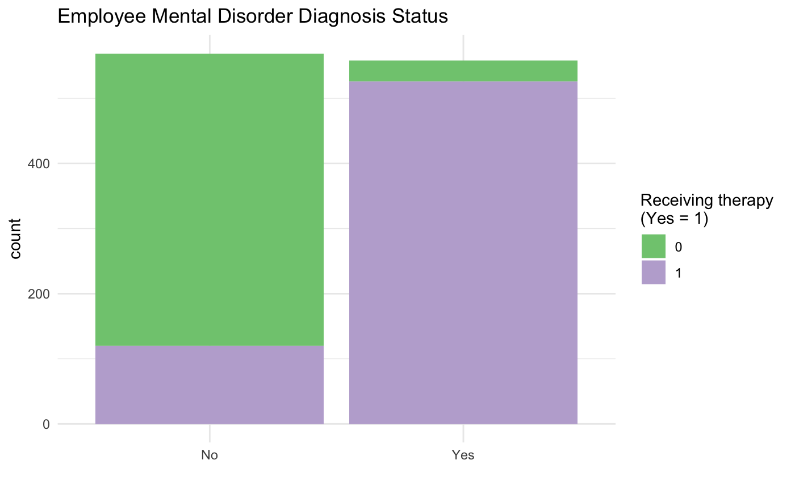
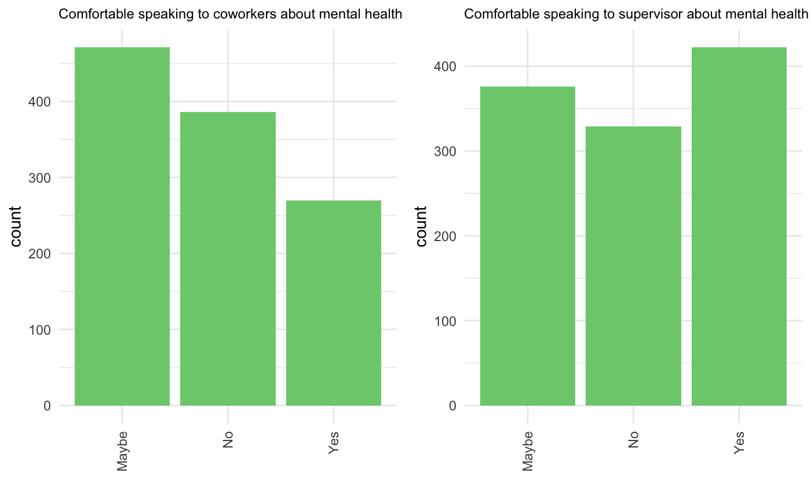
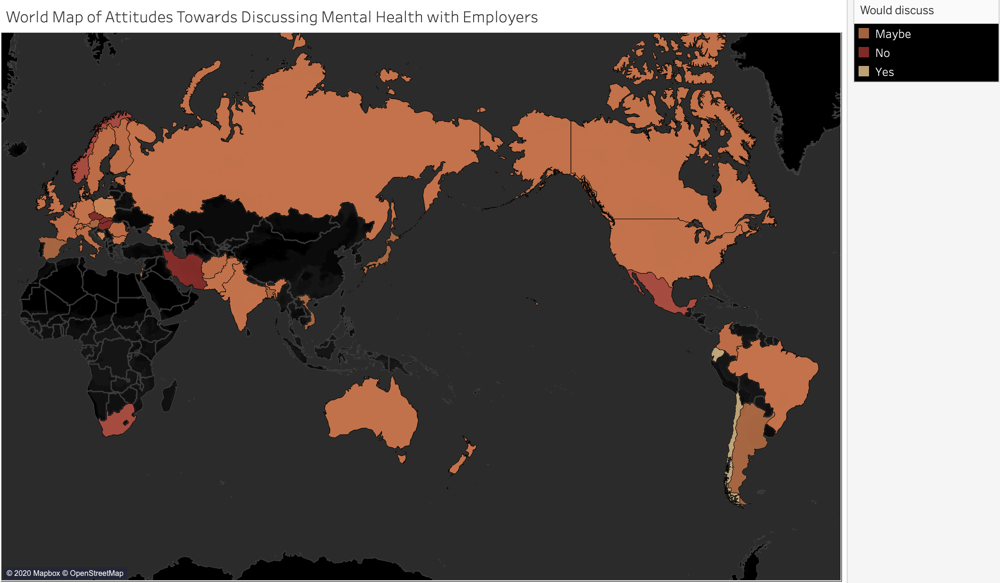

Exploratory Data Analysis
================

With the previously cleaned csv file (see 01\_do\_data\_cleaning.R), the
following exploratory data analysis (EDA) looks to determine general
patterns and characteristics of the project data prior to modeling.

**Overarching exploratory questions addressed**:

1.  Of the surveyed tech employees how many are clinically diagnosed
    with a mental disorder and/or receiving therapy? How often does this
    interfere with their work?

2.  How many tech employees are comfortable with or have spoken with
    their supervisors and/or coworkers about mental health? Does
    employee mental health status or gender impact these trends?

3.  How many companies offer mental health services? Does this vary
    according to company size? Could this impact employee willingness to
    discuss mental health?

4.  How many employees believe discussing their mental health with their
    employer would have negative consequences? How does this compare to
    the number of employees who believe discussing their physical health
    with their employer would have negative consequences?

5.  Do the number of average number of diagnosed mental disorders per
    surveyed employee vary according to country?

-----

Importing libraries…

``` r
library(tidyverse)
library(fastDummies)
library(ggplot2)
library(RColorBrewer)
library(gridExtra)
library(countrycode)
library(geojsonio)
source("~/Documents/Data_Science/projects/medium/code/script/functions/funs_do_exploratory_data_analysis.R")
```

Loading data…

``` r
clean_df <- read.csv("~/Documents/Data_Science/projects/medium/data/processed_data/mental-health-in-tech-2016-clean.csv", stringsAsFactors = FALSE)
head(clean_df)
```

    ##        employees company_role                     mh_benefits
    ## 1         26-100            1 Not eligible for coverage / N/A
    ## 2           6-25            1                              No
    ## 3           6-25            1                              No
    ## 4           6-25            0                             Yes
    ## 5 More than 1000            1                             Yes
    ## 6         26-100            1                    I don't know
    ##   mh_benefit_options mh_discussion mh_resources mh_anonymity
    ## 1                N/A            No           No I don't know
    ## 2                Yes           Yes          Yes          Yes
    ## 3                N/A            No           No I don't know
    ## 4                Yes            No           No           No
    ## 5      I am not sure            No          Yes          Yes
    ## 6                 No            No           No I don't know
    ##             mh_medical_leave mh_discussion_negative ph_discussion_negative
    ## 1                  Very easy                     No                     No
    ## 2              Somewhat easy                     No                     No
    ## 3 Neither easy nor difficult                  Maybe                     No
    ## 4 Neither easy nor difficult                    Yes                  Maybe
    ## 5              Somewhat easy                    Yes                    Yes
    ## 6              Somewhat easy                     No                     No
    ##   mh_discussion_coworkers mh_discussion_supervisor mh_ph_serious
    ## 1                   Maybe                      Yes  I don't know
    ## 2                   Maybe                      Yes           Yes
    ## 3                   Maybe                    Maybe  I don't know
    ## 4                   Maybe                       No            No
    ## 5                   Maybe                      Yes            No
    ## 6                   Maybe                      Yes           Yes
    ##   mh_coworker_consequences previous_employers previous_employers_mhbenefits
    ## 1                       No                  1                  No, none did
    ## 2                       No                  1             Yes, they all did
    ## 3                       No                  1                  No, none did
    ## 4                       No                  1                  I don't know
    ## 5                      Yes                  1                  No, none did
    ## 6                       No                  1                      Some did
    ##   previous_employers_mhbenefits_aware previous_employers_mhbenefits_discuss
    ## 1           N/A (not currently aware)                          I don't know
    ## 2                 I was aware of some                              None did
    ## 3           N/A (not currently aware)                              None did
    ## 4           N/A (not currently aware)                              Some did
    ## 5     Yes, I was aware of all of them                              None did
    ## 6                 I was aware of some                              None did
    ##   previous_employers_resources previous_employers_anonymtity
    ## 1                     None did                  I don't know
    ## 2                     Some did                   Yes, always
    ## 3                     Some did                  I don't know
    ## 4                     None did                  I don't know
    ## 5                     None did                  I don't know
    ## 6                     Some did                  I don't know
    ##   previous_employers_mh_discuss_impact previous_employers_ph_discuss_impact
    ## 1                         Some of them                         None of them
    ## 2                         None of them                         None of them
    ## 3                         I don't know                         Some of them
    ## 4                         Some of them                         Some of them
    ## 5                     Yes, all of them                         Some of them
    ## 6                         None of them                         None of them
    ##          previous_coworkers_mh_discuss       previous_supervisor_mh_discuss
    ## 1        Some of my previous employers        Some of my previous employers
    ## 2 No, at none of my previous employers        Some of my previous employers
    ## 3        Some of my previous employers                         I don't know
    ## 4 No, at none of my previous employers        Some of my previous employers
    ## 5 No, at none of my previous employers No, at none of my previous employers
    ## 6        Some of my previous employers Yes, at all of my previous employers
    ##   previous_employers_mh_ph_serious previous_employers_mh_coworkers_consequences
    ## 1                     I don't know                                 None of them
    ## 2                         Some did                                 None of them
    ## 3                     I don't know                                 Some of them
    ## 4                         Some did                                 Some of them
    ## 5                         None did                                 Some of them
    ## 6                         Some did                                 None of them
    ##   ph_interview
    ## 1        Maybe
    ## 2        Maybe
    ## 3          Yes
    ## 4        Maybe
    ## 5          Yes
    ## 6          Yes
    ##                                                                                                                                                                                                                                                                                     ph_interview_why
    ## 1                                                                                                                                                                                                                                                                                                   
    ## 2 It would depend on the health issue. If there is a health issue that would not immediately affect my job performance, such as diabetes, I would not bring it up during the interview. If it was something more severe, such as narcolepsy, I might bring it up depending on how controlled it was.
    ## 3                                                                                                                                                                                                                             They would provable need to know, to Judge if I can do my job or not. 
    ## 4                                                                                                                                                                                                                  Depending on the interview stage and whether I required an accommodation, I would
    ## 5                                                                                                                                                              If it would potentially affect my ability to do the job or might require special equipment/etc then it would only be fair and honest.
    ## 6                                                                                                                                                                                                                                               I want to gauge their ability to support this issue.
    ##   mh_interview
    ## 1        Maybe
    ## 2           No
    ## 3          Yes
    ## 4           No
    ## 5        Maybe
    ## 6          Yes
    ##                                                                                                                                                                                                                                                                                         mh_interview_why
    ## 1                                                                                                                                                                                                                                                                                                       
    ## 2 While mental health has become a more prominent issue recently, I feel like there is still a lot of stigma surrounding it. At this point, with our culture, I would not bring it up. I hope that within the next 20-30 years that stigma will be gone and it can be brought up safely in an interview.
    ## 3                                                                                                                                                                                                                                                                                       Stigma, mainly. 
    ## 4                                                                                                                                                                                                                                                                                           I don't know
    ## 5                                                                                                                                                                                                                                            It would depend on the field & what I knew of the employer.
    ## 6                                                                                                                                                                                                                  I want to gauge their ability to support, understand and empathize with my situation.
    ##          mh_id_career_impact       mh_id_coworkers_impact
    ## 1                      Maybe No, I don't think they would
    ## 2 No, I don't think it would No, I don't think they would
    ## 3                      Maybe                        Maybe
    ## 4      Yes, I think it would                        Maybe
    ## 5      Yes, I think it would                        Maybe
    ## 6      Yes, I think it would No, I don't think they would
    ##                                       mh_family_friends
    ## 1                                         Somewhat open
    ## 2                                         Somewhat open
    ## 3                                         Somewhat open
    ## 4                                         Somewhat open
    ## 5                                         Somewhat open
    ## 6 Not applicable to me (I do not have a mental illness)
    ##   mh_unsupportive_workplace mh_other_impact mi_family mh_past mh_current
    ## 1                        No                        No     Yes         No
    ## 2                        No                       Yes     Yes        Yes
    ## 3            Maybe/Not sure             Yes        No   Maybe         No
    ## 4        Yes, I experienced             Yes       Yes     Yes        Yes
    ## 5        Yes, I experienced              No        No      No        Yes
    ## 6                        No                        No      No         No
    ##                                                                                      mh_current_specify
    ## 1                                                                                                      
    ## 2 Anxiety Disorder (Generalized, Social, Phobia, etc)|Mood Disorder (Depression, Bipolar Disorder, etc)
    ## 3                                                                                                      
    ## 4                         Anxiety Disorder (Generalized, Social, Phobia, etc)|Stress Response Syndromes
    ## 5  Anxiety Disorder (Generalized, Social, Phobia, etc)|Stress Response Syndromes|Substance Use Disorder
    ## 6                                                                                                      
    ##   mh_dx mh_treatment mh_interfere_treated mh_interfere_not_treated age gender
    ## 1   Yes            0 Not applicable to me     Not applicable to me  39   Male
    ## 2   Yes            1               Rarely                Sometimes  29   Male
    ## 3    No            1 Not applicable to me     Not applicable to me  38   Male
    ## 4   Yes            1            Sometimes                Sometimes  43 Female
    ## 5    No            1 Not applicable to me                    Often  42   Male
    ## 6    No            0 Not applicable to me     Not applicable to me  30   Male
    ##           resident_country resident_state_territory             work_country
    ## 1           United Kingdom                                    United Kingdom
    ## 2 United States of America                 Illinois United States of America
    ## 3           United Kingdom                                    United Kingdom
    ## 4 United States of America                 Illinois United States of America
    ## 5           United Kingdom                                    United Kingdom
    ## 6 United States of America                Tennessee United States of America
    ##   work_state_territory
    ## 1                     
    ## 2             Illinois
    ## 3                     
    ## 4             Illinois
    ## 5                     
    ## 6            Tennessee
    ##                                                                                                                      work_position
    ## 1                                                                                                               Back-end Developer
    ## 2                                                                                           Back-end Developer|Front-end Developer
    ## 3                                                                                                               Back-end Developer
    ## 4 Executive Leadership|Supervisor/Team Lead|Dev Evangelist/Advocate|DevOps/SysAdmin|Support|Back-end Developer|Front-end Developer
    ## 5                                                          DevOps/SysAdmin|Support|Back-end Developer|Front-end Developer|Designer
    ## 6                                                                                                               Back-end Developer
    ##   work_remote anxiety_dx mood_dx substance_dx stress_dx ocd_dx personality_dx
    ## 1   Sometimes          1       0            0         0      0              0
    ## 2       Never          1       1            0         0      0              0
    ## 3      Always          0       0            0         0      0              0
    ## 4   Sometimes          1       0            0         0      0              0
    ## 5   Sometimes          0       0            0         0      0              0
    ## 6   Sometimes          0       0            0         0      0              0
    ##   adhd_dx ptsd_dx addictive_dx ed_dx sad_dx suicidal_dx dissociative_dx
    ## 1       0       0            0     0      0           0               0
    ## 2       0       0            0     0      0           0               0
    ## 3       0       0            0     0      0           0               0
    ## 4       0       0            0     0      0           0               0
    ## 5       0       0            0     0      0           0               0
    ## 6       0       0            0     0      0           0               0
    ##   gender_dx psychotic_dx schizotypal_dx anxiety_belief mood_belief
    ## 1         0            0              0              0           0
    ## 2         0            0              0              0           0
    ## 3         0            0              0              0           0
    ## 4         0            0              0              0           0
    ## 5         0            0              0              0           0
    ## 6         0            0              0              0           0
    ##   substance_belief stress_belief ocd_belief personality_belief adhd_belief
    ## 1                0             0          0                  0           0
    ## 2                0             0          0                  0           0
    ## 3                0             0          0                  0           0
    ## 4                0             0          0                  0           0
    ## 5                0             0          0                  0           0
    ## 6                0             0          0                  0           0
    ##   ptsd_belief addictive_belief ed_belief sad_belief suicidal_belief
    ## 1           0                0         0          0               0
    ## 2           0                0         0          0               0
    ## 3           0                0         0          0               0
    ## 4           0                0         0          0               0
    ## 5           0                0         0          0               0
    ## 6           0                0         0          0               0
    ##   dissociative_belief gender_belief psychotic_belief schizotypal_belief
    ## 1                   0             0                0                  0
    ## 2                   0             0                0                  0
    ## 3                   0             0                0                  0
    ## 4                   0             0                0                  0
    ## 5                   0             0                0                  0
    ## 6                   0             0                0                  0
    ##   total_dx total_dx_belief
    ## 1        1               0
    ## 2        2               0
    ## 3        0               0
    ## 4        1               0
    ## 5        0               0
    ## 6        0               0

``` r
str(clean_df)
```

    ## 'data.frame':    1127 obs. of  85 variables:
    ##  $ employees                                   : chr  "26-100" "6-25" "6-25" "6-25" ...
    ##  $ company_role                                : int  1 1 1 0 1 1 1 0 1 0 ...
    ##  $ mh_benefits                                 : chr  "Not eligible for coverage / N/A" "No" "No" "Yes" ...
    ##  $ mh_benefit_options                          : chr  "N/A" "Yes" "N/A" "Yes" ...
    ##  $ mh_discussion                               : chr  "No" "Yes" "No" "No" ...
    ##  $ mh_resources                                : chr  "No" "Yes" "No" "No" ...
    ##  $ mh_anonymity                                : chr  "I don't know" "Yes" "I don't know" "No" ...
    ##  $ mh_medical_leave                            : chr  "Very easy" "Somewhat easy" "Neither easy nor difficult" "Neither easy nor difficult" ...
    ##  $ mh_discussion_negative                      : chr  "No" "No" "Maybe" "Yes" ...
    ##  $ ph_discussion_negative                      : chr  "No" "No" "No" "Maybe" ...
    ##  $ mh_discussion_coworkers                     : chr  "Maybe" "Maybe" "Maybe" "Maybe" ...
    ##  $ mh_discussion_supervisor                    : chr  "Yes" "Yes" "Maybe" "No" ...
    ##  $ mh_ph_serious                               : chr  "I don't know" "Yes" "I don't know" "No" ...
    ##  $ mh_coworker_consequences                    : chr  "No" "No" "No" "No" ...
    ##  $ previous_employers                          : int  1 1 1 1 1 1 1 1 1 1 ...
    ##  $ previous_employers_mhbenefits               : chr  "No, none did" "Yes, they all did" "No, none did" "I don't know" ...
    ##  $ previous_employers_mhbenefits_aware         : chr  "N/A (not currently aware)" "I was aware of some" "N/A (not currently aware)" "N/A (not currently aware)" ...
    ##  $ previous_employers_mhbenefits_discuss       : chr  "I don't know" "None did" "None did" "Some did" ...
    ##  $ previous_employers_resources                : chr  "None did" "Some did" "Some did" "None did" ...
    ##  $ previous_employers_anonymtity               : chr  "I don't know" "Yes, always" "I don't know" "I don't know" ...
    ##  $ previous_employers_mh_discuss_impact        : chr  "Some of them" "None of them" "I don't know" "Some of them" ...
    ##  $ previous_employers_ph_discuss_impact        : chr  "None of them" "None of them" "Some of them" "Some of them" ...
    ##  $ previous_coworkers_mh_discuss               : chr  "Some of my previous employers" "No, at none of my previous employers" "Some of my previous employers" "No, at none of my previous employers" ...
    ##  $ previous_supervisor_mh_discuss              : chr  "Some of my previous employers" "Some of my previous employers" "I don't know" "Some of my previous employers" ...
    ##  $ previous_employers_mh_ph_serious            : chr  "I don't know" "Some did" "I don't know" "Some did" ...
    ##  $ previous_employers_mh_coworkers_consequences: chr  "None of them" "None of them" "Some of them" "Some of them" ...
    ##  $ ph_interview                                : chr  "Maybe" "Maybe" "Yes" "Maybe" ...
    ##  $ ph_interview_why                            : chr  "" "It would depend on the health issue. If there is a health issue that would not immediately affect my job perfor"| __truncated__ "They would provable need to know, to Judge if I can do my job or not. " "Depending on the interview stage and whether I required an accommodation, I would" ...
    ##  $ mh_interview                                : chr  "Maybe" "No" "Yes" "No" ...
    ##  $ mh_interview_why                            : chr  "" "While mental health has become a more prominent issue recently, I feel like there is still a lot of stigma surr"| __truncated__ "Stigma, mainly. " "I don't know" ...
    ##  $ mh_id_career_impact                         : chr  "Maybe" "No, I don't think it would" "Maybe" "Yes, I think it would" ...
    ##  $ mh_id_coworkers_impact                      : chr  "No, I don't think they would" "No, I don't think they would" "Maybe" "Maybe" ...
    ##  $ mh_family_friends                           : chr  "Somewhat open" "Somewhat open" "Somewhat open" "Somewhat open" ...
    ##  $ mh_unsupportive_workplace                   : chr  "No" "No" "Maybe/Not sure" "Yes, I experienced" ...
    ##  $ mh_other_impact                             : chr  "" "" "Yes" "Yes" ...
    ##  $ mi_family                                   : chr  "No" "Yes" "No" "Yes" ...
    ##  $ mh_past                                     : chr  "Yes" "Yes" "Maybe" "Yes" ...
    ##  $ mh_current                                  : chr  "No" "Yes" "No" "Yes" ...
    ##  $ mh_current_specify                          : chr  "" "Anxiety Disorder (Generalized, Social, Phobia, etc)|Mood Disorder (Depression, Bipolar Disorder, etc)" "" "Anxiety Disorder (Generalized, Social, Phobia, etc)|Stress Response Syndromes" ...
    ##  $ mh_dx                                       : chr  "Yes" "Yes" "No" "Yes" ...
    ##  $ mh_treatment                                : int  0 1 1 1 1 0 1 1 1 1 ...
    ##  $ mh_interfere_treated                        : chr  "Not applicable to me" "Rarely" "Not applicable to me" "Sometimes" ...
    ##  $ mh_interfere_not_treated                    : chr  "Not applicable to me" "Sometimes" "Not applicable to me" "Sometimes" ...
    ##  $ age                                         : int  39 29 38 43 42 30 37 44 28 34 ...
    ##  $ gender                                      : chr  "Male" "Male" "Male" "Female" ...
    ##  $ resident_country                            : chr  "United Kingdom" "United States of America" "United Kingdom" "United States of America" ...
    ##  $ resident_state_territory                    : chr  "" "Illinois" "" "Illinois" ...
    ##  $ work_country                                : chr  "United Kingdom" "United States of America" "United Kingdom" "United States of America" ...
    ##  $ work_state_territory                        : chr  "" "Illinois" "" "Illinois" ...
    ##  $ work_position                               : chr  "Back-end Developer" "Back-end Developer|Front-end Developer" "Back-end Developer" "Executive Leadership|Supervisor/Team Lead|Dev Evangelist/Advocate|DevOps/SysAdmin|Support|Back-end Developer|Fr"| __truncated__ ...
    ##  $ work_remote                                 : chr  "Sometimes" "Never" "Always" "Sometimes" ...
    ##  $ anxiety_dx                                  : int  1 1 0 1 0 0 1 0 0 1 ...
    ##  $ mood_dx                                     : int  0 1 0 0 0 0 0 1 1 0 ...
    ##  $ substance_dx                                : int  0 0 0 0 0 0 1 0 0 0 ...
    ##  $ stress_dx                                   : int  0 0 0 0 0 0 0 0 0 0 ...
    ##  $ ocd_dx                                      : int  0 0 0 0 0 0 0 0 0 0 ...
    ##  $ personality_dx                              : int  0 0 0 0 0 0 0 0 0 0 ...
    ##  $ adhd_dx                                     : int  0 0 0 0 0 0 0 0 0 0 ...
    ##  $ ptsd_dx                                     : int  0 0 0 0 0 0 0 0 0 0 ...
    ##  $ addictive_dx                                : int  0 0 0 0 0 0 0 0 0 0 ...
    ##  $ ed_dx                                       : int  0 0 0 0 0 0 0 0 0 0 ...
    ##  $ sad_dx                                      : int  0 0 0 0 0 0 0 0 0 0 ...
    ##  $ suicidal_dx                                 : int  0 0 0 0 0 0 0 0 0 0 ...
    ##  $ dissociative_dx                             : int  0 0 0 0 0 0 0 0 0 0 ...
    ##  $ gender_dx                                   : int  0 0 0 0 0 0 0 0 0 0 ...
    ##  $ psychotic_dx                                : int  0 0 0 0 0 0 0 0 0 0 ...
    ##  $ schizotypal_dx                              : int  0 0 0 0 0 0 0 0 0 0 ...
    ##  $ anxiety_belief                              : int  0 0 0 0 0 0 0 0 0 0 ...
    ##  $ mood_belief                                 : int  0 0 0 0 0 0 0 0 0 0 ...
    ##  $ substance_belief                            : int  0 0 0 0 0 0 0 0 0 0 ...
    ##  $ stress_belief                               : int  0 0 0 0 0 0 0 0 0 0 ...
    ##  $ ocd_belief                                  : int  0 0 0 0 0 0 0 0 0 0 ...
    ##  $ personality_belief                          : int  0 0 0 0 0 0 0 0 0 0 ...
    ##  $ adhd_belief                                 : int  0 0 0 0 0 0 0 0 0 0 ...
    ##  $ ptsd_belief                                 : int  0 0 0 0 0 0 0 0 0 0 ...
    ##  $ addictive_belief                            : int  0 0 0 0 0 0 0 0 0 0 ...
    ##  $ ed_belief                                   : int  0 0 0 0 0 0 0 0 0 0 ...
    ##  $ sad_belief                                  : int  0 0 0 0 0 0 0 0 0 0 ...
    ##  $ suicidal_belief                             : int  0 0 0 0 0 0 0 0 0 0 ...
    ##  $ dissociative_belief                         : int  0 0 0 0 0 0 0 0 0 0 ...
    ##  $ gender_belief                               : int  0 0 0 0 0 0 0 0 0 0 ...
    ##  $ psychotic_belief                            : int  0 0 0 0 0 0 0 0 0 0 ...
    ##  $ schizotypal_belief                          : int  0 0 0 0 0 0 0 0 0 0 ...
    ##  $ total_dx                                    : int  1 2 0 1 0 0 2 1 1 1 ...
    ##  $ total_dx_belief                             : int  0 0 0 0 0 0 0 0 0 0 ...

The survey data has 1127 observations (participants) and 85 variables.
There are no missing values, and only 3 continuous variables.

``` r
summary(clean_df$age)
```

    ##    Min. 1st Qu.  Median    Mean 3rd Qu.    Max. 
    ##   17.00   28.00   32.00   33.32   38.00   70.00

``` r
table(clean_df$gender)
```

    ## 
    ## Female   Male  Other 
    ##    263    840     24

The average age of the company-employed employees surveyed is 33.32
years, with a range of 17 to 70 years. Of these employees 263 identified
as female, 840 identified as male and 24 indicated an alternative gender
identify, underscoring the significant gender gap often prevalent in
tech-related companaies.

## \#\#\#\# EDA topic \#1

  - Of the surveyed tech employees how many are clinically diagnosed
    with a mental disorder and/or receiving therapy? How often does this
    interfere with their work?

<!-- end list -->

``` r
ggplot(clean_df, aes(mh_dx)) +
  geom_bar(aes(fill = as.factor(mh_treatment))) +
    scale_fill_brewer(palette="Accent") +
    theme_minimal() +
    labs(fill = "Receiving therapy \n(Yes = 1)") +
    xlab(" ") +
    ggtitle("Employee Mental Disorder Diagnosis Status")
```

<!-- -->


There is a very similar number of participants with and without a mental
disorder diagnosis. The vast majority of those with a mental disorder
attend therapy, while most of those without a diagnosis do not.

``` r
dx_df <- clean_df %>% filter(mh_dx == "Yes")
no_dx_df <- clean_df %>% filter(mh_dx == "No")

p1 <- PlotMIInterference(dx_df, dx_df$mh_interfere_treated)
p1 <- p1 + ggtitle("Amount of workday interference treated mental disorders cause") +
    theme(axis.text.x = element_text(angle = 90, vjust = 0.5, hjust=1)) + 
    theme(plot.title = element_text(size=7))

p2 <- PlotMIInterference(dx_df, dx_df$mh_interfere_not_treated)
p2 <- p2 + ggtitle("Amount of workday interference untreated mental disorders cause")+ 
    theme(axis.text.x = element_text(angle = 90, vjust = 0.5, hjust=1)) + 
    theme(plot.title = element_text(size=7))

grid.arrange(p1, p2, nrow = 1)
```

<!-- -->


Those with a mental disorder and also receiving therapy have less
interference in their workplace productivity due to mental health
concerns compared to those with a mental disorder who aren’t receiving
therapy.

## \#\#\#\# EDA topic \#2

  - How many tech employees are comfortable with or have spoken with
    their supervisors and/or coworkers about mental health? Does
    employee mental health status or gender impact these trends?

<!-- end list -->

``` r
p3 <- PlotMIComfort(clean_df, clean_df$mh_discussion_coworkers)
p3 <- p3 + ggtitle("Comfortable speaking to coworkers about mental health") + 
    theme(plot.title = element_text(size=9))

p4 <- PlotMIComfort(clean_df, clean_df$mh_discussion_supervisor)
p4 <- p4 + ggtitle("Comfortable speaking to supervisor about mental health") + 
    theme(plot.title = element_text(size=9))

grid.arrange(p3, p4, nrow = 1)
```

<!-- -->
 More people are willing to talk to their supervisors
about their mental health than coworkers. We can also further delineate
the above distribution by demographic information with a dpylr
dataframe.

``` r
coworker_demo_table <- DemoTable("mh_discussion_coworkers")
```

    ## Warning: select_() is deprecated. 
    ## Please use select() instead
    ## 
    ## The 'programming' vignette or the tidyeval book can help you
    ## to program with select() : https://tidyeval.tidyverse.org
    ## This warning is displayed once per session.

    ## Warning: group_by_() is deprecated. 
    ## Please use group_by() instead
    ## 
    ## The 'programming' vignette or the tidyeval book can help you
    ## to program with group_by() : https://tidyeval.tidyverse.org
    ## This warning is displayed once per session.

``` r
head(coworker_demo_table)
```

    ## # A tibble: 3 x 6
    ##   mh_discussion_c… `sum(gender_Fem… `sum(gender_Mal… `sum(gender_Oth…
    ##   <chr>                       <int>            <int>            <int>
    ## 1 Maybe                         105              356               10
    ## 2 No                             95              283                8
    ## 3 Yes                            63              201                6
    ## # … with 2 more variables: `sum(mh_dx_Yes)` <int>, `sum(mh_dx_No)` <int>

``` r
supervisor_demo_table <- DemoTable("mh_discussion_supervisor")
head(supervisor_demo_table)
```

    ## # A tibble: 3 x 6
    ##   mh_discussion_s… `sum(gender_Fem… `sum(gender_Mal… `sum(gender_Oth…
    ##   <chr>                       <int>            <int>            <int>
    ## 1 Maybe                          85              283                8
    ## 2 No                             79              242                8
    ## 3 Yes                            99              315                8
    ## # … with 2 more variables: `sum(mh_dx_Yes)` <int>, `sum(mh_dx_No)` <int>

## \#\#\#\# EDA topic \#3

  - How many companies offer mental health services? Does this vary
    according to company size? Could this impact employee willingness to
    discuss mental health?

<!-- end list -->

``` r
ggplot(clean_df, aes(mh_resources)) +
  geom_bar(aes(fill = as.factor(mh_discussion_supervisor))) +
    scale_fill_brewer(palette="Accent") +
    theme_minimal() +
    labs(fill = "Employee willing to \ndiscuss mental health \nwith supervisor") +
    xlab(" ") +
    ggtitle("Number of Tech Companies Providing Mental Health Resources") +
    coord_flip()
```

<!-- -->
 We will also create a quick table to see if there is a
potential relationship between company-offered mental health services
and employees’ willingness to talk to their supervisor about their
mental health status.

``` r
table(clean_df$mh_resources, clean_df$mh_discussion_supervisor)
```

    ##               
    ##                Maybe  No Yes
    ##   I don't know   117  83 115
    ##   No             180 184 159
    ##   Yes             79  62 148

51% of employees’ whose company offers mental health resources would
feel comfortable disclosing their personal mental health status to their
supervisors, compared to the 30% of employees without company-offered
mental health services.

## \#\#\#\# EDA topic \#4

  - How many employees believe discussing their mental health with their
    employer would have negative consequences? How does this compare to
    the number of employees who believe discussing their physical health
    with their employer would have negative consequences?

<!-- end list -->

``` r
p7 <- PlotMIComfort(clean_df, clean_df$mh_discussion_negative)
p7 <- p7 + ggtitle("Belief of Negative Consequences for Mental Health") + 
    theme(plot.title = element_text(size=9))

p8 <- PlotMIComfort(clean_df, clean_df$ph_discussion_negative)
p8 <- p8 + ggtitle("Belief of Negative Consequences for Physical Health") + 
    theme(plot.title = element_text(size=9))

grid.arrange(p7, p8, nrow = 1)
```

<!-- -->


We can also see if this is impacted by witnessing a coworker deal with
negative consequences after disclosing their mental health status to
their employer with a quick table again.

``` r
table(clean_df$mh_discussion_negative, clean_df$mh_coworker_consequences, dnn = c("Belief of Negative Impact", "Coworker Consequences"))
```

    ##                          Coworker Consequences
    ## Belief of Negative Impact  No Yes
    ##                     Maybe 446  34
    ##                     No    420  14
    ##                     Yes   168  45

## \#\#\#\# EDA topic \#5

  - Do the number of average number of diagnosed mental disorders per
    surveyed employee vary according to country?

To do so, first we have to create a dataframe with the country of work
iso3 code, world map latitude and longitude coordinates and an
engineered feature of average mental disorder diagnoses per country’s
surveyed employees.

``` r
map_df <- clean_df
map_df <- map_df[!(map_df$work_country=="Other"),]
map_df$work_country <- countrycode(map_df$work_country, origin = 'country.name', destination = 'iso3c')
count_df <- as.data.frame(table(map_df$work_country))
count_df = count_df %>% rename(code = Var1)

map_df <- map_df %>% select(work_country, total_dx) %>%
  group_by(work_country) %>%
  summarise(sum(total_dx)) %>%
  rename(code = work_country, sum_dx = 'sum(total_dx)')

joined_map <- left_join(count_df, map_df, by = "code")
```

    ## Warning: Column `code` joining factor and character vector, coercing into
    ## character vector

``` r
joined_map$dx_ratio <- joined_map$sum_dx/joined_map$Freq
```

And finally, we plot the average number of mental disorders an employee
from a given country has onto the world map to better visualize the
ratios.

``` r
PlotWorldMap(joined_map)
```

    ## Warning in countrycode(map_img$region, origin = "country.name", destination = "iso3c"): Some values were not matched unambiguously: Ascension Island, Azores, Barbuda, Bonaire, Canary Islands, Chagos Archipelago, Grenadines, Heard Island, Kosovo, Madeira Islands, Micronesia, Saba, Saint Martin, Siachen Glacier, Sint Eustatius, Virgin Islands

<!-- -->
 To also visualize how employee’s beliefs around the
potential consequences of discussing their mental health with their
employers vary by country, we can easily display this categorical
feature on a world map by using the data viz tool Tableau.



We can also map attitudes towards mental health discussions with
employers by state. 
