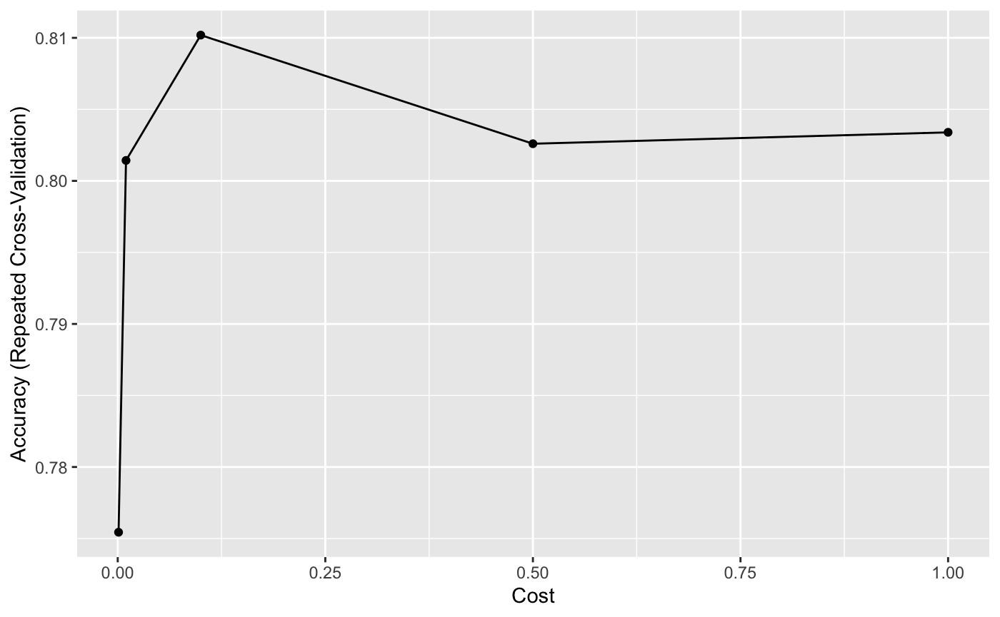
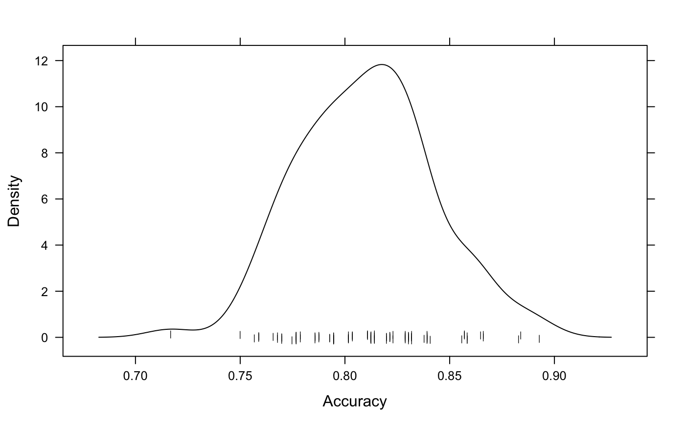
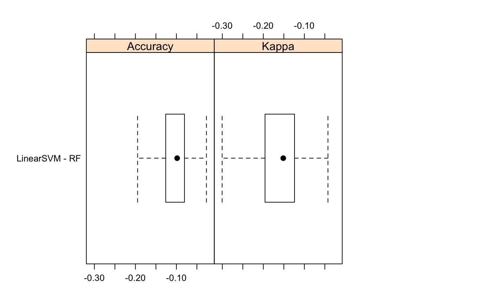

```{r setup, include=FALSE}
knitr::opts_chunk$set(echo = TRUE, message = FALSE, warning = FALSE)
```

The following is a summary of model selection and results as run by /script/03_do_caret_modeling.R.

**Overview**:      
Although mental illnesses are common and affect an estimated 10.7% of the world population and as many as 1 in every 5 Americans, mental health is still a highly stigmatized and sensitive subject within the workplace. 

Utilizing 2016 survey data from tech employees across the world (see project README.md for source details), the following looks to determine what influences employees' attitudes towards speaking about their mental health status within the workplace. A series of supervised learning algorithms are implemented, predicting tech employees' response to the question "Do you think that discussing a mental health disorder with your employer would have negative consequences?" as "Maybe", "No", or "Yes".

----

Importing libraries...
```{r libs}
library(tidyverse)
library(caret)
library(DMwR)
library(ggplot2)
source("~/Documents/Data_Science/projects/medium/code/script/functions/funs_do_feature_selection.R")
source("~/Documents/Data_Science/projects/medium/code/script/functions/funs_do_caret_modeling.R")
```

Loading data...
```{r data}
clean_df <- read.csv("~/Documents/Data_Science/projects/medium/data/processed_data/mental-health-in-tech-2016-modeling.csv")

dim(clean_df)
head(clean_df)
```

The survey data has 1127 observations (tech employees) and 147 variables, most of which were categorical variables  dummy coded via one-hot encoding in /script/03_do_feature_selection.R. This is still quite a few potential predictor variables, which we'll have to keep in mind while chosing our model parameters. 

### Training Test Data Split

```{r data split}
trainIndex <- createDataPartition(clean_df$mh_discussion_negative, p = .75, 
                                  list = FALSE, 
                                  times = 1)
trainData <- clean_df[ trainIndex,]
testData <- clean_df[-trainIndex,]
```

### Class Imbalance

Now that our data is split into training and test subsamples, we should also double-check for outcome variable class imbalance, which could potentially interfere with our modeling results. 

```{r cimbalance}
PlotCatDist(trainData, trainData$mh_discussion_negative)

trainSmote <- SMOTE(mh_discussion_negative ~ ., data  = trainData)                         
table(trainSmote$mh_discussion_negative)
```


## Classification

We'll move onto modeling. Because the ratio of observations to predictor variables is rather low, we will want to implement algorithms with a higher bias/lower variance trade-off to best combat overfitting. As such, regularization methods, simpler algorithms such as Linear SVM, and feature selection prior to model fitting are best suited to the project at hand. 

### Linear SVM with Feature Selection

```{r svm sbf}
svmGrid <-  expand.grid(C = c(.001, .01, .1, 0.5, 1.0))

set.seed(101)
ft_selected <- SelectFeatures(svmGrid, "svmLinear", trainSmote)
```

```{r svm train}
set.seed(101)
svmMod <- FitTrainingModel(svmGrid, "svmLinear", trainSmote[,c(ft_selected,"mh_discussion_negative")], TRUE)
svmMod
```

```{r svm plots}
trellis.par.set(caretTheme())

ggplot(svmMod)  
densityplot(svmMod, pch = "|")
```



```{r svm prediction}
set.seed(101)
svm_test_results <- FitTestModel(svmMod, testData)
svm_test_results
```

### Random Forest with Feature Selection

```{r rf feature selection}
rfGrid <-  expand.grid(mtry = c(2, 3, 4, 5),
                      splitrule = c("gini", "extratrees"),
                      min.node.size = c(1, 3, 5))

set.seed(101)
rf_ft_selected <- SelectFeatures(svmGrid, "ranger", trainSmote)
```


```{r rf train}
set.seed(101)
rfMod <- FitTrainingModel(rfGrid, "ranger", trainSmote[,c(rf_ft_selected,"mh_discussion_negative")], "impurity")
rfMod
```


```{r rf plots}
trellis.par.set(caretTheme())

ggplot(rfMod)  
densityplot(rfMod, pch = "|")
```


```{r rf test results}
set.seed(101)
rf_test_results <- FitTestModel(rfMod, testData)
rf_test_results
```


## Model Comparison

```{r svm varimp}
plot(varImp(svmMod), top=20)
```
```{r rf varimp}
plot(varImp(rfMod), top=20)
```
Both models show the following as significant predictors of employee attitudes towards discussing their mental health status with employers:

* Whether or not company supervisor has ever brought up mental health in a formal company capacity
* Perceived difficulty around requesting medical leave for mental health-related purposes
* Perceived impact discussing mental health would have on career and coworkers' perception of him/her/them
* Perceived impact discussing physical health would have on relationship with supervisor
* Whether physical and mental health are perceived to be valued similarly by company policy  
* Experiences with previous employers surrounding discussing mental health

We can also directly compare model performance with the following: 

```{r compare models}
resamps <- resamples(list(LinearSVM = svmMod,
                          RF = rfMod))
resamps
summary(resamps)
```

```{r compare models 2}
difValues <- diff(resamps)
difValues
summary(difValues)

trellis.par.set(caretTheme())
bwplot(difValues, layout = c(3, 1))
```


According to the above results, we can see the two models are very similar, although Random Forest slightly outperforms the Linear SVM model.