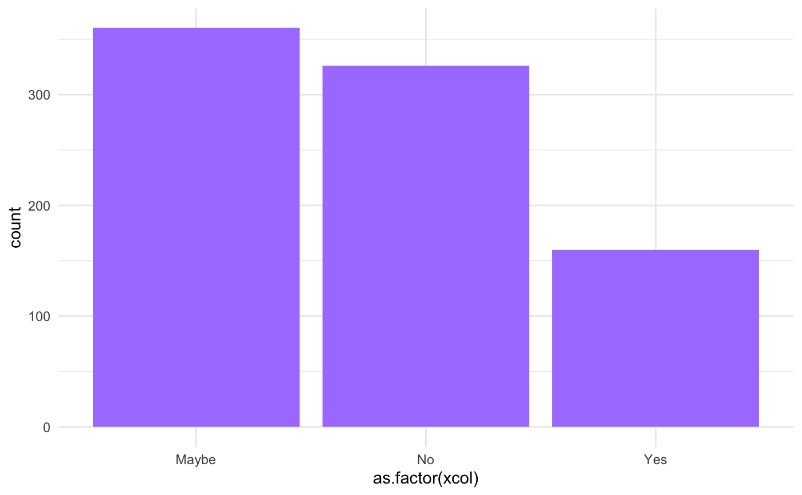
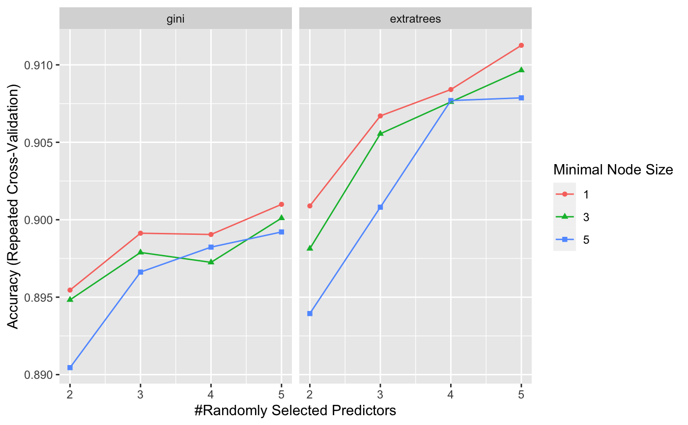
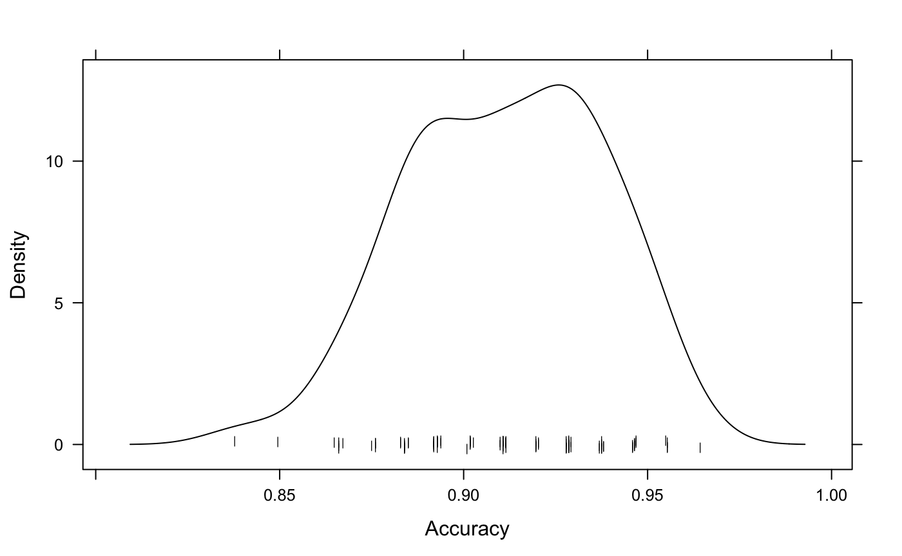
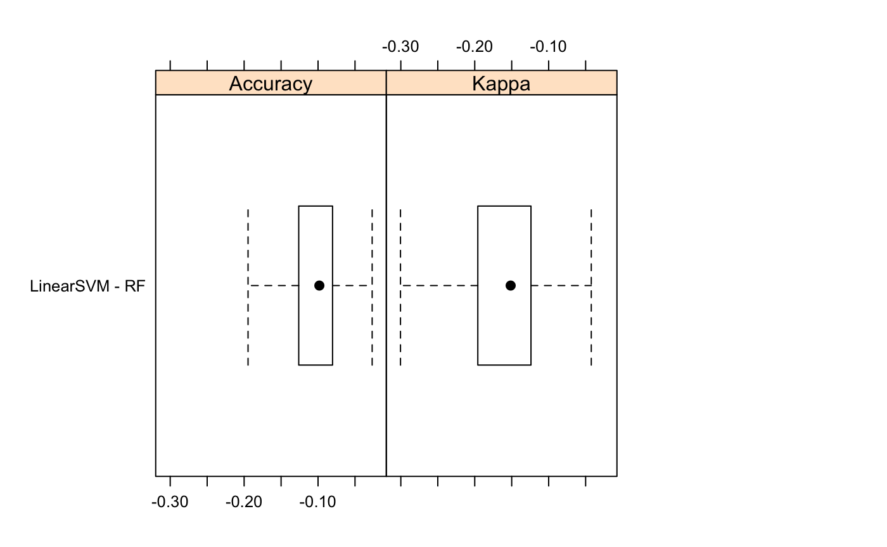

Project Results
================

The following is a summary of model selection and results as run by
/script/03\_do\_caret\_modeling.R.

**Overview**:  
Although mental illnesses are common and affect an estimated 10.7% of
the world population and as many as 1 in every 5 Americans, mental
health is still a highly stigmatized and sensitive subject within the
workplace.

Utilizing 2016 survey data from tech employees across the world (see
project README.md for source details), the following looks to determine
what influences employees’ attitudes towards speaking about their mental
health status within the workplace. A series of supervised learning
algorithms are implemented, predicting tech employees’ response to the
question “Do you think that discussing a mental health disorder with
your employer would have negative consequences?” as “Maybe”, “No”, or
“Yes”.

-----

Importing libraries…

``` r
library(tidyverse)
library(caret)
library(DMwR)
library(ggplot2)
source("~/Documents/Data_Science/projects/medium/code/script/functions/funs_do_feature_selection.R")
source("~/Documents/Data_Science/projects/medium/code/script/functions/funs_do_caret_modeling.R")
```

Loading data…

``` r
clean_df <- read.csv("~/Documents/Data_Science/projects/medium/data/processed_data/mental-health-in-tech-2016-modeling.csv")

dim(clean_df)
```

    ## [1] 1127  157

``` r
head(clean_df)
```

    ##   employees.1.5 employees.100.500 employees.26.100 employees.500.1000
    ## 1             0                 0                1                  0
    ## 2             0                 0                0                  0
    ## 3             0                 0                0                  0
    ## 4             0                 0                0                  0
    ## 5             0                 0                0                  0
    ## 6             0                 0                1                  0
    ##   employees.6.25 employees.More.than.1000 company_role mh_benefits.I.don.t.know
    ## 1              0                        0            1                        0
    ## 2              1                        0            1                        0
    ## 3              1                        0            1                        0
    ## 4              1                        0            0                        0
    ## 5              0                        1            1                        0
    ## 6              0                        0            1                        1
    ##   mh_benefits.No mh_benefits.Not.eligible.for.coverage...N.A mh_benefits.Yes
    ## 1              0                                           1               0
    ## 2              1                                           0               0
    ## 3              1                                           0               0
    ## 4              0                                           0               1
    ## 5              0                                           0               1
    ## 6              0                                           0               0
    ##   mh_benefit_options.I.am.not.sure mh_benefit_options.N.A mh_benefit_options.No
    ## 1                                0                      1                     0
    ## 2                                0                      0                     0
    ## 3                                0                      1                     0
    ## 4                                0                      0                     0
    ## 5                                1                      0                     0
    ## 6                                0                      0                     1
    ##   mh_benefit_options.Yes mh_discussion.I.don.t.know mh_discussion.No
    ## 1                      0                          0                1
    ## 2                      1                          0                0
    ## 3                      0                          0                1
    ## 4                      1                          0                1
    ## 5                      0                          0                1
    ## 6                      0                          0                1
    ##   mh_discussion.Yes mh_resources.I.don.t.know mh_resources.No mh_resources.Yes
    ## 1                 0                         0               1                0
    ## 2                 1                         0               0                1
    ## 3                 0                         0               1                0
    ## 4                 0                         0               1                0
    ## 5                 0                         0               0                1
    ## 6                 0                         0               1                0
    ##   mh_anonymity.I.don.t.know mh_anonymity.No mh_anonymity.Yes
    ## 1                         1               0                0
    ## 2                         0               0                1
    ## 3                         1               0                0
    ## 4                         0               1                0
    ## 5                         0               0                1
    ## 6                         1               0                0
    ##   mh_medical_leave.I.don.t.know mh_medical_leave.Neither.easy.nor.difficult
    ## 1                             0                                           0
    ## 2                             0                                           0
    ## 3                             0                                           1
    ## 4                             0                                           1
    ## 5                             0                                           0
    ## 6                             0                                           0
    ##   mh_medical_leave.Somewhat.difficult mh_medical_leave.Somewhat.easy
    ## 1                                   0                              0
    ## 2                                   0                              1
    ## 3                                   0                              0
    ## 4                                   0                              0
    ## 5                                   0                              1
    ## 6                                   0                              1
    ##   mh_medical_leave.Very.difficult mh_medical_leave.Very.easy
    ## 1                               0                          1
    ## 2                               0                          0
    ## 3                               0                          0
    ## 4                               0                          0
    ## 5                               0                          0
    ## 6                               0                          0
    ##   ph_discussion_negative.Maybe ph_discussion_negative.No
    ## 1                            0                         1
    ## 2                            0                         1
    ## 3                            0                         1
    ## 4                            1                         0
    ## 5                            0                         0
    ## 6                            0                         1
    ##   mh_discussion_coworkers.Maybe mh_discussion_coworkers.No
    ## 1                             1                          0
    ## 2                             1                          0
    ## 3                             1                          0
    ## 4                             1                          0
    ## 5                             1                          0
    ## 6                             1                          0
    ##   mh_discussion_coworkers.Yes mh_discussion_supervisor.Maybe
    ## 1                           0                              0
    ## 2                           0                              0
    ## 3                           0                              1
    ## 4                           0                              0
    ## 5                           0                              0
    ## 6                           0                              0
    ##   mh_discussion_supervisor.No mh_discussion_supervisor.Yes
    ## 1                           0                            1
    ## 2                           0                            1
    ## 3                           0                            0
    ## 4                           1                            0
    ## 5                           0                            1
    ## 6                           0                            1
    ##   mh_ph_serious.I.don.t.know mh_ph_serious.No mh_ph_serious.Yes
    ## 1                          1                0                 0
    ## 2                          0                0                 1
    ## 3                          1                0                 0
    ## 4                          0                1                 0
    ## 5                          0                1                 0
    ## 6                          0                0                 1
    ##   mh_coworker_consequences.No mh_coworker_consequences.Yes previous_employers
    ## 1                           1                            0                  1
    ## 2                           1                            0                  1
    ## 3                           1                            0                  1
    ## 4                           1                            0                  1
    ## 5                           0                            1                  1
    ## 6                           1                            0                  1
    ##   previous_employers_mhbenefits. previous_employers_mhbenefits.I.don.t.know
    ## 1                              0                                          0
    ## 2                              0                                          0
    ## 3                              0                                          0
    ## 4                              0                                          1
    ## 5                              0                                          0
    ## 6                              0                                          0
    ##   previous_employers_mhbenefits.No..none.did
    ## 1                                          1
    ## 2                                          0
    ## 3                                          1
    ## 4                                          0
    ## 5                                          1
    ## 6                                          0
    ##   previous_employers_mhbenefits.Some.did
    ## 1                                      0
    ## 2                                      0
    ## 3                                      0
    ## 4                                      0
    ## 5                                      0
    ## 6                                      1
    ##   previous_employers_mhbenefits.Yes..they.all.did
    ## 1                                               0
    ## 2                                               1
    ## 3                                               0
    ## 4                                               0
    ## 5                                               0
    ## 6                                               0
    ##   previous_employers_mhbenefits_aware.
    ## 1                                    0
    ## 2                                    0
    ## 3                                    0
    ## 4                                    0
    ## 5                                    0
    ## 6                                    0
    ##   previous_employers_mhbenefits_aware.I.was.aware.of.some
    ## 1                                                       0
    ## 2                                                       1
    ## 3                                                       0
    ## 4                                                       0
    ## 5                                                       0
    ## 6                                                       1
    ##   previous_employers_mhbenefits_aware.N.A..not.currently.aware.
    ## 1                                                             1
    ## 2                                                             0
    ## 3                                                             1
    ## 4                                                             1
    ## 5                                                             0
    ## 6                                                             0
    ##   previous_employers_mhbenefits_aware.No..I.only.became.aware.later
    ## 1                                                                 0
    ## 2                                                                 0
    ## 3                                                                 0
    ## 4                                                                 0
    ## 5                                                                 0
    ## 6                                                                 0
    ##   previous_employers_mhbenefits_aware.Yes..I.was.aware.of.all.of.them
    ## 1                                                                   0
    ## 2                                                                   0
    ## 3                                                                   0
    ## 4                                                                   0
    ## 5                                                                   1
    ## 6                                                                   0
    ##   previous_employers_mhbenefits_discuss.
    ## 1                                      0
    ## 2                                      0
    ## 3                                      0
    ## 4                                      0
    ## 5                                      0
    ## 6                                      0
    ##   previous_employers_mhbenefits_discuss.I.don.t.know
    ## 1                                                  1
    ## 2                                                  0
    ## 3                                                  0
    ## 4                                                  0
    ## 5                                                  0
    ## 6                                                  0
    ##   previous_employers_mhbenefits_discuss.None.did
    ## 1                                              0
    ## 2                                              1
    ## 3                                              1
    ## 4                                              0
    ## 5                                              1
    ## 6                                              1
    ##   previous_employers_mhbenefits_discuss.Some.did previous_employers_resources.
    ## 1                                              0                             0
    ## 2                                              0                             0
    ## 3                                              0                             0
    ## 4                                              1                             0
    ## 5                                              0                             0
    ## 6                                              0                             0
    ##   previous_employers_resources.None.did previous_employers_resources.Some.did
    ## 1                                     1                                     0
    ## 2                                     0                                     1
    ## 3                                     0                                     1
    ## 4                                     1                                     0
    ## 5                                     1                                     0
    ## 6                                     0                                     1
    ##   previous_employers_anonymtity. previous_employers_anonymtity.I.don.t.know
    ## 1                              0                                          1
    ## 2                              0                                          0
    ## 3                              0                                          1
    ## 4                              0                                          1
    ## 5                              0                                          1
    ## 6                              0                                          1
    ##   previous_employers_anonymtity.No previous_employers_anonymtity.Sometimes
    ## 1                                0                                       0
    ## 2                                0                                       0
    ## 3                                0                                       0
    ## 4                                0                                       0
    ## 5                                0                                       0
    ## 6                                0                                       0
    ##   previous_employers_anonymtity.Yes..always
    ## 1                                         0
    ## 2                                         1
    ## 3                                         0
    ## 4                                         0
    ## 5                                         0
    ## 6                                         0
    ##   previous_employers_mh_discuss_impact.
    ## 1                                     0
    ## 2                                     0
    ## 3                                     0
    ## 4                                     0
    ## 5                                     0
    ## 6                                     0
    ##   previous_employers_mh_discuss_impact.I.don.t.know
    ## 1                                                 0
    ## 2                                                 0
    ## 3                                                 1
    ## 4                                                 0
    ## 5                                                 0
    ## 6                                                 0
    ##   previous_employers_mh_discuss_impact.None.of.them
    ## 1                                                 0
    ## 2                                                 1
    ## 3                                                 0
    ## 4                                                 0
    ## 5                                                 0
    ## 6                                                 1
    ##   previous_employers_mh_discuss_impact.Some.of.them
    ## 1                                                 1
    ## 2                                                 0
    ## 3                                                 0
    ## 4                                                 1
    ## 5                                                 0
    ## 6                                                 0
    ##   previous_employers_mh_discuss_impact.Yes..all.of.them
    ## 1                                                     0
    ## 2                                                     0
    ## 3                                                     0
    ## 4                                                     0
    ## 5                                                     1
    ## 6                                                     0
    ##   previous_employers_ph_discuss_impact.
    ## 1                                     0
    ## 2                                     0
    ## 3                                     0
    ## 4                                     0
    ## 5                                     0
    ## 6                                     0
    ##   previous_employers_ph_discuss_impact.None.of.them
    ## 1                                                 1
    ## 2                                                 1
    ## 3                                                 0
    ## 4                                                 0
    ## 5                                                 0
    ## 6                                                 1
    ##   previous_employers_ph_discuss_impact.Some.of.them
    ## 1                                                 0
    ## 2                                                 0
    ## 3                                                 1
    ## 4                                                 1
    ## 5                                                 1
    ## 6                                                 0
    ##   previous_employers_ph_discuss_impact.Yes..all.of.them
    ## 1                                                     0
    ## 2                                                     0
    ## 3                                                     0
    ## 4                                                     0
    ## 5                                                     0
    ## 6                                                     0
    ##   previous_coworkers_mh_discuss.
    ## 1                              0
    ## 2                              0
    ## 3                              0
    ## 4                              0
    ## 5                              0
    ## 6                              0
    ##   previous_coworkers_mh_discuss.No..at.none.of.my.previous.employers
    ## 1                                                                  0
    ## 2                                                                  1
    ## 3                                                                  0
    ## 4                                                                  1
    ## 5                                                                  1
    ## 6                                                                  0
    ##   previous_coworkers_mh_discuss.Some.of.my.previous.employers
    ## 1                                                           1
    ## 2                                                           0
    ## 3                                                           1
    ## 4                                                           0
    ## 5                                                           0
    ## 6                                                           1
    ##   previous_coworkers_mh_discuss.Yes..at.all.of.my.previous.employers
    ## 1                                                                  0
    ## 2                                                                  0
    ## 3                                                                  0
    ## 4                                                                  0
    ## 5                                                                  0
    ## 6                                                                  0
    ##   previous_supervisor_mh_discuss. previous_supervisor_mh_discuss.I.don.t.know
    ## 1                               0                                           0
    ## 2                               0                                           0
    ## 3                               0                                           1
    ## 4                               0                                           0
    ## 5                               0                                           0
    ## 6                               0                                           0
    ##   previous_supervisor_mh_discuss.No..at.none.of.my.previous.employers
    ## 1                                                                   0
    ## 2                                                                   0
    ## 3                                                                   0
    ## 4                                                                   0
    ## 5                                                                   1
    ## 6                                                                   0
    ##   previous_supervisor_mh_discuss.Some.of.my.previous.employers
    ## 1                                                            1
    ## 2                                                            1
    ## 3                                                            0
    ## 4                                                            1
    ## 5                                                            0
    ## 6                                                            0
    ##   previous_supervisor_mh_discuss.Yes..at.all.of.my.previous.employers
    ## 1                                                                   0
    ## 2                                                                   0
    ## 3                                                                   0
    ## 4                                                                   0
    ## 5                                                                   0
    ## 6                                                                   1
    ##   previous_employers_mh_ph_serious.
    ## 1                                 0
    ## 2                                 0
    ## 3                                 0
    ## 4                                 0
    ## 5                                 0
    ## 6                                 0
    ##   previous_employers_mh_ph_serious.I.don.t.know
    ## 1                                             1
    ## 2                                             0
    ## 3                                             1
    ## 4                                             0
    ## 5                                             0
    ## 6                                             0
    ##   previous_employers_mh_ph_serious.None.did
    ## 1                                         0
    ## 2                                         0
    ## 3                                         0
    ## 4                                         0
    ## 5                                         1
    ## 6                                         0
    ##   previous_employers_mh_ph_serious.Some.did
    ## 1                                         0
    ## 2                                         1
    ## 3                                         0
    ## 4                                         1
    ## 5                                         0
    ## 6                                         1
    ##   previous_employers_mh_coworkers_consequences.
    ## 1                                             0
    ## 2                                             0
    ## 3                                             0
    ## 4                                             0
    ## 5                                             0
    ## 6                                             0
    ##   previous_employers_mh_coworkers_consequences.None.of.them
    ## 1                                                         1
    ## 2                                                         1
    ## 3                                                         0
    ## 4                                                         0
    ## 5                                                         0
    ## 6                                                         1
    ##   previous_employers_mh_coworkers_consequences.Some.of.them ph_interview.Maybe
    ## 1                                                         0                  1
    ## 2                                                         0                  1
    ## 3                                                         1                  0
    ## 4                                                         1                  1
    ## 5                                                         1                  0
    ## 6                                                         0                  0
    ##   ph_interview.No ph_interview.Yes mh_interview.Maybe mh_interview.No
    ## 1               0                0                  1               0
    ## 2               0                0                  0               1
    ## 3               0                1                  0               0
    ## 4               0                0                  0               1
    ## 5               0                1                  1               0
    ## 6               0                1                  0               0
    ##   mh_interview.Yes mh_id_career_impact.Maybe
    ## 1                0                         1
    ## 2                0                         0
    ## 3                1                         1
    ## 4                0                         0
    ## 5                0                         0
    ## 6                1                         0
    ##   mh_id_career_impact.No..I.don.t.think.it.would
    ## 1                                              0
    ## 2                                              1
    ## 3                                              0
    ## 4                                              0
    ## 5                                              0
    ## 6                                              0
    ##   mh_id_career_impact.Yes..I.think.it.would mh_id_career_impact.Yes..it.has
    ## 1                                         0                               0
    ## 2                                         0                               0
    ## 3                                         0                               0
    ## 4                                         1                               0
    ## 5                                         1                               0
    ## 6                                         1                               0
    ##   mh_id_coworkers_impact.Maybe
    ## 1                            0
    ## 2                            0
    ## 3                            1
    ## 4                            1
    ## 5                            1
    ## 6                            0
    ##   mh_id_coworkers_impact.No..I.don.t.think.they.would
    ## 1                                                   1
    ## 2                                                   1
    ## 3                                                   0
    ## 4                                                   0
    ## 5                                                   0
    ## 6                                                   1
    ##   mh_id_coworkers_impact.Yes..I.think.they.would mh_family_friends.Neutral
    ## 1                                              0                         0
    ## 2                                              0                         0
    ## 3                                              0                         0
    ## 4                                              0                         0
    ## 5                                              0                         0
    ## 6                                              0                         0
    ##   mh_family_friends.Not.applicable.to.me..I.do.not.have.a.mental.illness.
    ## 1                                                                       0
    ## 2                                                                       0
    ## 3                                                                       0
    ## 4                                                                       0
    ## 5                                                                       0
    ## 6                                                                       1
    ##   mh_family_friends.Not.open.at.all mh_family_friends.Somewhat.not.open
    ## 1                                 0                                   0
    ## 2                                 0                                   0
    ## 3                                 0                                   0
    ## 4                                 0                                   0
    ## 5                                 0                                   0
    ## 6                                 0                                   0
    ##   mh_family_friends.Somewhat.open mh_family_friends.Very.open
    ## 1                               1                           0
    ## 2                               1                           0
    ## 3                               1                           0
    ## 4                               1                           0
    ## 5                               1                           0
    ## 6                               0                           0
    ##   mh_unsupportive_workplace.Maybe.Not.sure mh_unsupportive_workplace.No
    ## 1                                        0                            1
    ## 2                                        0                            1
    ## 3                                        1                            0
    ## 4                                        0                            0
    ## 5                                        0                            0
    ## 6                                        0                            1
    ##   mh_unsupportive_workplace.Yes..I.experienced
    ## 1                                            0
    ## 2                                            0
    ## 3                                            0
    ## 4                                            1
    ## 5                                            1
    ## 6                                            0
    ##   mh_unsupportive_workplace.Yes..I.observed mh_other_impact.
    ## 1                                         0                1
    ## 2                                         0                1
    ## 3                                         0                0
    ## 4                                         0                0
    ## 5                                         0                0
    ## 6                                         0                1
    ##   mh_other_impact.Maybe mh_other_impact.N.A mh_other_impact.No
    ## 1                     0                   0                  0
    ## 2                     0                   0                  0
    ## 3                     0                   0                  0
    ## 4                     0                   0                  0
    ## 5                     0                   0                  1
    ## 6                     0                   0                  0
    ##   mh_other_impact.Yes mi_family.I.don.t.know mi_family.No mi_family.Yes
    ## 1                   0                      0            1             0
    ## 2                   0                      0            0             1
    ## 3                   1                      0            1             0
    ## 4                   1                      0            0             1
    ## 5                   0                      0            1             0
    ## 6                   0                      0            1             0
    ##   mh_past.Maybe mh_past.No mh_past.Yes mh_current.Maybe mh_current.No
    ## 1             0          0           1                0             1
    ## 2             0          0           1                0             0
    ## 3             1          0           0                0             1
    ## 4             0          0           1                0             0
    ## 5             0          1           0                0             0
    ## 6             0          1           0                0             1
    ##   mh_current.Yes mh_dx.No mh_dx.Yes mh_treatment mh_interfere_treated.Never
    ## 1              0        0         1            0                          0
    ## 2              1        0         1            1                          0
    ## 3              0        1         0            1                          0
    ## 4              1        0         1            1                          0
    ## 5              1        1         0            1                          0
    ## 6              0        1         0            0                          0
    ##   mh_interfere_treated.Not.applicable.to.me mh_interfere_treated.Rarely
    ## 1                                         1                           0
    ## 2                                         0                           1
    ## 3                                         1                           0
    ## 4                                         0                           0
    ## 5                                         1                           0
    ## 6                                         1                           0
    ##   mh_interfere_treated.Sometimes mh_interfere_not_treated.Not.applicable.to.me
    ## 1                              0                                             1
    ## 2                              0                                             0
    ## 3                              0                                             1
    ## 4                              1                                             0
    ## 5                              0                                             0
    ## 6                              0                                             1
    ##   mh_interfere_not_treated.Often mh_interfere_not_treated.Sometimes
    ## 1                              0                                  0
    ## 2                              0                                  1
    ## 3                              0                                  0
    ## 4                              0                                  1
    ## 5                              1                                  0
    ## 6                              0                                  0
    ##   gender.Female gender.Male resident_countryOther resident_countryUK
    ## 1             0           1                     0                  1
    ## 2             0           1                     0                  0
    ## 3             0           1                     0                  1
    ## 4             1           0                     0                  0
    ## 5             0           1                     0                  1
    ## 6             0           1                     0                  0
    ##   resident_countryUSA work_countryOther work_countryUK work_countryUSA
    ## 1                   0                 0              1               0
    ## 2                   1                 0              0               1
    ## 3                   0                 0              1               0
    ## 4                   1                 0              0               1
    ## 5                   0                 0              1               0
    ## 6                   1                 0              0               1
    ##   work_position.Back.end.Developer
    ## 1                                1
    ## 2                                0
    ## 3                                1
    ## 4                                0
    ## 5                                0
    ## 6                                1
    ##   work_position.Back.end.Developer.Front.end.Developer
    ## 1                                                    0
    ## 2                                                    1
    ## 3                                                    0
    ## 4                                                    0
    ## 5                                                    0
    ## 6                                                    0
    ##   work_position.Front.end.Developer work_position.Other
    ## 1                                 0                   0
    ## 2                                 0                   0
    ## 3                                 0                   0
    ## 4                                 0                   0
    ## 5                                 0                   0
    ## 6                                 0                   0
    ##   work_position.Supervisor.Team.Lead work_remote.Always work_remote.Never
    ## 1                                  0                  0                 0
    ## 2                                  0                  0                 1
    ## 3                                  0                  1                 0
    ## 4                                  0                  0                 0
    ## 5                                  0                  0                 0
    ## 6                                  0                  0                 0
    ##   work_remote.Sometimes mh_discussion_negative total_dx total_dx_belief
    ## 1                     1                     No        1               0
    ## 2                     0                     No        2               0
    ## 3                     0                  Maybe        0               0
    ## 4                     1                    Yes        1               0
    ## 5                     1                    Yes        0               0
    ## 6                     1                     No        0               0

The survey data has 1127 observations (tech employees) and 147
variables, most of which were categorical variables dummy coded via
one-hot encoding in /script/03\_do\_feature\_selection.R. This is still
quite a few potential predictor variables, which we’ll have to keep in
mind while chosing our model parameters.

### Training Test Data Split

``` r
trainIndex <- createDataPartition(clean_df$mh_discussion_negative, p = .75, 
                                  list = FALSE, 
                                  times = 1)
trainData <- clean_df[ trainIndex,]
testData <- clean_df[-trainIndex,]
```

### Class Imbalance

Now that our data is split into training and test subsamples, we should
also double-check for outcome variable class imbalance, which could
potentially interfere with our modeling results.

``` r
PlotCatDist(trainData, trainData$mh_discussion_negative)
```

<!-- -->

``` r
trainSmote <- SMOTE(mh_discussion_negative ~ ., data  = trainData)                         
table(trainSmote$mh_discussion_negative)
```

    ## 
    ## Maybe    No   Yes 
    ##   323   317   480



## Classification

We’ll move onto modeling. Because the ratio of observations to predictor
variables is rather low, we will want to implement algorithms with a
higher bias/lower variance trade-off to best combat overfitting. As
such, regularization methods, simpler algorithms such as Linear SVM, and
feature selection prior to model fitting are best suited to the project
at hand.

### Linear SVM with Feature Selection

``` r
svmGrid <-  expand.grid(C = c(.001, .01, .1, 0.5, 1.0))

set.seed(101)
ft_selected <- SelectFeatures(svmGrid, "svmLinear", trainSmote)
```

``` r
set.seed(101)
svmMod <- FitTrainingModel(svmGrid, "svmLinear", trainSmote[,c(ft_selected,"mh_discussion_negative")], TRUE)
svmMod
```

    ## Support Vector Machines with Linear Kernel 
    ## 
    ## 1120 samples
    ##  115 predictor
    ##    3 classes: 'Maybe', 'No', 'Yes' 
    ## 
    ## No pre-processing
    ## Resampling: Cross-Validated (10 fold, repeated 10 times) 
    ## Summary of sample sizes: 1008, 1008, 1007, 1008, 1008, 1008, ... 
    ## Resampling results across tuning parameters:
    ## 
    ##   C      Accuracy   Kappa    
    ##   0.001  0.7472281  0.6118334
    ##   0.010  0.7940339  0.6834429
    ##   0.100  0.8103339  0.7081866
    ##   0.500  0.8217725  0.7258572
    ##   1.000  0.8228576  0.7274933
    ## 
    ## Accuracy was used to select the optimal model using the largest value.
    ## The final value used for the model was C = 1.

``` r
trellis.par.set(caretTheme())

ggplot(svmMod)  
```

<!-- -->

``` r
densityplot(svmMod, pch = "|")
```

<!-- -->
 

``` r
set.seed(101)
svm_test_results <- FitTestModel(svmMod, testData)
svm_test_results
```

    ## Confusion Matrix and Statistics
    ## 
    ##           Reference
    ## Prediction Maybe No Yes
    ##      Maybe    47 28  18
    ##      No       35 79   4
    ##      Yes      38  1  31
    ## 
    ## Overall Statistics
    ##                                           
    ##                Accuracy : 0.5587          
    ##                  95% CI : (0.4985, 0.6177)
    ##     No Information Rate : 0.427           
    ##     P-Value [Acc > NIR] : 6.143e-06       
    ##                                           
    ##                   Kappa : 0.3214          
    ##                                           
    ##  Mcnemar's Test P-Value : 0.0211          
    ## 
    ## Statistics by Class:
    ## 
    ##                      Class: Maybe Class: No Class: Yes
    ## Sensitivity                0.3917    0.7315     0.5849
    ## Specificity                0.7143    0.7746     0.8289
    ## Pos Pred Value             0.5054    0.6695     0.4429
    ## Neg Pred Value             0.6117    0.8221     0.8957
    ## Prevalence                 0.4270    0.3843     0.1886
    ## Detection Rate             0.1673    0.2811     0.1103
    ## Detection Prevalence       0.3310    0.4199     0.2491
    ## Balanced Accuracy          0.5530    0.7530     0.7069

### Random Forest with Feature Selection

``` r
rfGrid <-  expand.grid(mtry = c(2, 3, 4, 5),
                      splitrule = c("gini", "extratrees"),
                      min.node.size = c(1, 3, 5))

set.seed(101)
rf_ft_selected <- SelectFeatures(svmGrid, "ranger", trainSmote)
```

``` r
set.seed(101)
rfMod <- FitTrainingModel(rfGrid, "ranger", trainSmote[,c(rf_ft_selected,"mh_discussion_negative")], "impurity")
rfMod
```

    ## Random Forest 
    ## 
    ## 1120 samples
    ##  115 predictor
    ##    3 classes: 'Maybe', 'No', 'Yes' 
    ## 
    ## No pre-processing
    ## Resampling: Cross-Validated (10 fold, repeated 10 times) 
    ## Summary of sample sizes: 1008, 1008, 1007, 1008, 1008, 1008, ... 
    ## Resampling results across tuning parameters:
    ## 
    ##   mtry  splitrule   min.node.size  Accuracy   Kappa    
    ##   2     gini        1              0.8892811  0.8300856
    ##   2     gini        3              0.8881155  0.8282325
    ##   2     gini        5              0.8828595  0.8200975
    ##   2     extratrees  1              0.8908787  0.8309286
    ##   2     extratrees  3              0.8914256  0.8317704
    ##   2     extratrees  5              0.8831936  0.8188566
    ##   3     gini        1              0.8952674  0.8393866
    ##   3     gini        3              0.8941034  0.8375936
    ##   3     gini        5              0.8931300  0.8361431
    ##   3     extratrees  1              0.9025014  0.8492676
    ##   3     extratrees  3              0.9012546  0.8473247
    ##   3     extratrees  5              0.8998220  0.8450692
    ##   4     gini        1              0.8965956  0.8415162
    ##   4     gini        3              0.8958015  0.8402527
    ##   4     gini        5              0.8944686  0.8382498
    ##   4     extratrees  1              0.9087556  0.8591074
    ##   4     extratrees  3              0.9067051  0.8558897
    ##   4     extratrees  5              0.9073350  0.8568482
    ##   5     gini        1              0.8947349  0.8386496
    ##   5     gini        3              0.8975044  0.8429521
    ##   5     gini        5              0.8945594  0.8384831
    ##   5     extratrees  1              0.9103660  0.8616305
    ##   5     extratrees  3              0.9098382  0.8608176
    ##   5     extratrees  5              0.9090266  0.8595331
    ## 
    ## Accuracy was used to select the optimal model using the largest value.
    ## The final values used for the model were mtry = 5, splitrule = extratrees
    ##  and min.node.size = 1.

``` r
trellis.par.set(caretTheme())

ggplot(rfMod)  
```

<!-- -->

``` r
densityplot(rfMod, pch = "|")
```

<!-- -->
 

``` r
set.seed(101)
rf_test_results <- FitTestModel(rfMod, testData)
rf_test_results
```

    ## Confusion Matrix and Statistics
    ## 
    ##           Reference
    ## Prediction Maybe No Yes
    ##      Maybe    58 13  18
    ##      No       31 93   3
    ##      Yes      31  2  32
    ## 
    ## Overall Statistics
    ##                                           
    ##                Accuracy : 0.6512          
    ##                  95% CI : (0.5924, 0.7069)
    ##     No Information Rate : 0.427           
    ##     P-Value [Acc > NIR] : 3.201e-14       
    ##                                           
    ##                   Kappa : 0.4613          
    ##                                           
    ##  Mcnemar's Test P-Value : 0.01166         
    ## 
    ## Statistics by Class:
    ## 
    ##                      Class: Maybe Class: No Class: Yes
    ## Sensitivity                0.4833    0.8611     0.6038
    ## Specificity                0.8075    0.8035     0.8553
    ## Pos Pred Value             0.6517    0.7323     0.4923
    ## Neg Pred Value             0.6771    0.9026     0.9028
    ## Prevalence                 0.4270    0.3843     0.1886
    ## Detection Rate             0.2064    0.3310     0.1139
    ## Detection Prevalence       0.3167    0.4520     0.2313
    ## Balanced Accuracy          0.6454    0.8323     0.7295

## Model Comparison

``` r
plot(varImp(svmMod), top=20)
```

<!-- -->

``` r
plot(varImp(rfMod), top=20)
```

<!-- --> Both
models show the following as significant predictors of employee
attitudes towards discussing their mental health status with employers:

  - Whether or not company supervisor has ever brought up mental health
    in a formal company capacity
  - Perceived difficulty around requesting medical leave for mental
    health-related purposes
  - Perceived impact discussing mental health would have on career and
    coworkers’ perception of him/her/them
  - Perceived impact discussing physical health would have on
    relationship with supervisor
  - Whether physical and mental health are perceived to be valued
    similarly by company policy  
  - Experiences with previous employers surrounding discussing mental
    health

We can also directly compare model performance with the following:

``` r
resamps <- resamples(list(LinearSVM = svmMod,
                          RF = rfMod))
resamps
```

    ## 
    ## Call:
    ## resamples.default(x = list(LinearSVM = svmMod, RF = rfMod))
    ## 
    ## Models: LinearSVM, RF 
    ## Number of resamples: 100 
    ## Performance metrics: Accuracy, Kappa 
    ## Time estimates for: everything, final model fit

``` r
summary(resamps)
```

    ## 
    ## Call:
    ## summary.resamples(object = resamps)
    ## 
    ## Models: LinearSVM, RF 
    ## Number of resamples: 100 
    ## 
    ## Accuracy 
    ##                Min.   1st Qu.    Median      Mean   3rd Qu.      Max. NA's
    ## LinearSVM 0.7500000 0.8035714 0.8214286 0.8228576 0.8392857 0.8928571    0
    ## RF        0.8468468 0.8928571 0.9107143 0.9103660 0.9285714 0.9639640    0
    ## 
    ## Kappa 
    ##                Min.   1st Qu.    Median      Mean   3rd Qu.      Max. NA's
    ## LinearSVM 0.6194175 0.6984472 0.7257588 0.7274933 0.7540262 0.8352941    0
    ## RF        0.7632668 0.8343195 0.8627451 0.8616305 0.8898179 0.9446246    0

``` r
difValues <- diff(resamps)
difValues
```

    ## 
    ## Call:
    ## diff.resamples(x = resamps)
    ## 
    ## Models: LinearSVM, RF 
    ## Metrics: Accuracy, Kappa 
    ## Number of differences: 1 
    ## p-value adjustment: bonferroni

``` r
summary(difValues)
```

    ## 
    ## Call:
    ## summary.diff.resamples(object = difValues)
    ## 
    ## p-value adjustment: bonferroni 
    ## Upper diagonal: estimates of the difference
    ## Lower diagonal: p-value for H0: difference = 0
    ## 
    ## Accuracy 
    ##           LinearSVM RF      
    ## LinearSVM           -0.08751
    ## RF        < 2.2e-16         
    ## 
    ## Kappa 
    ##           LinearSVM RF     
    ## LinearSVM           -0.1341
    ## RF        < 2.2e-16

``` r
trellis.par.set(caretTheme())
bwplot(difValues, layout = c(3, 1))
```

<!-- -->


According to the above results, we can see the two models are very
similar, although Random Forest slightly outperforms the Linear SVM
model.
